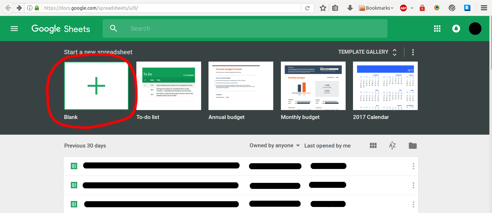
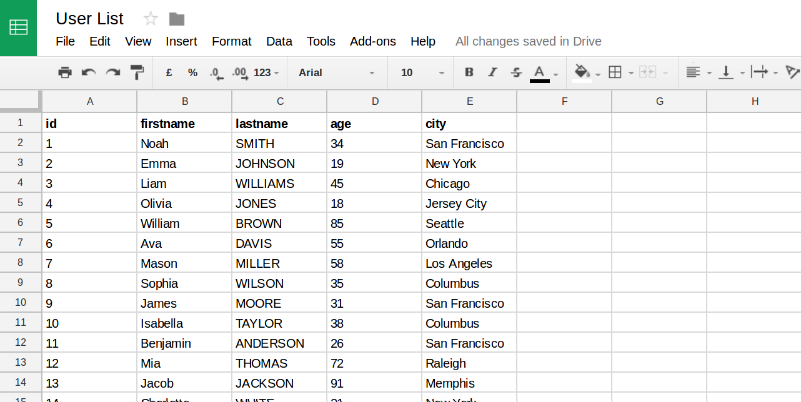
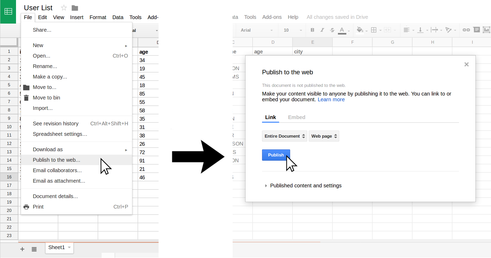
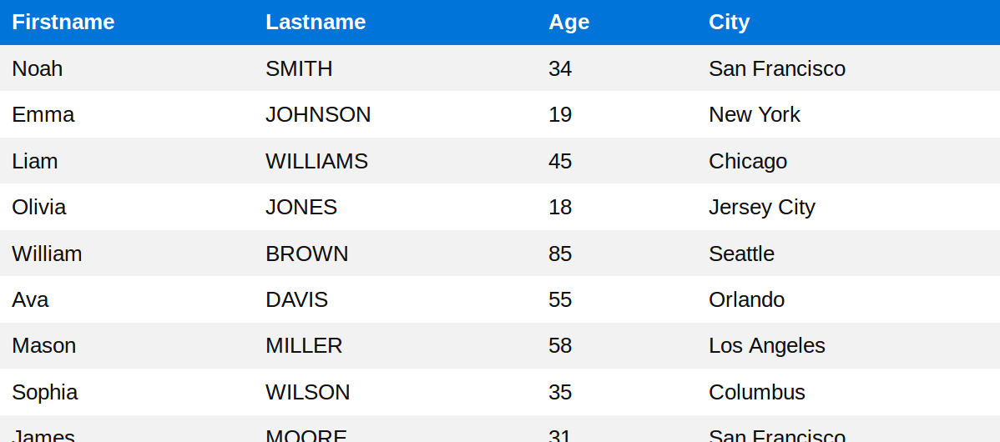
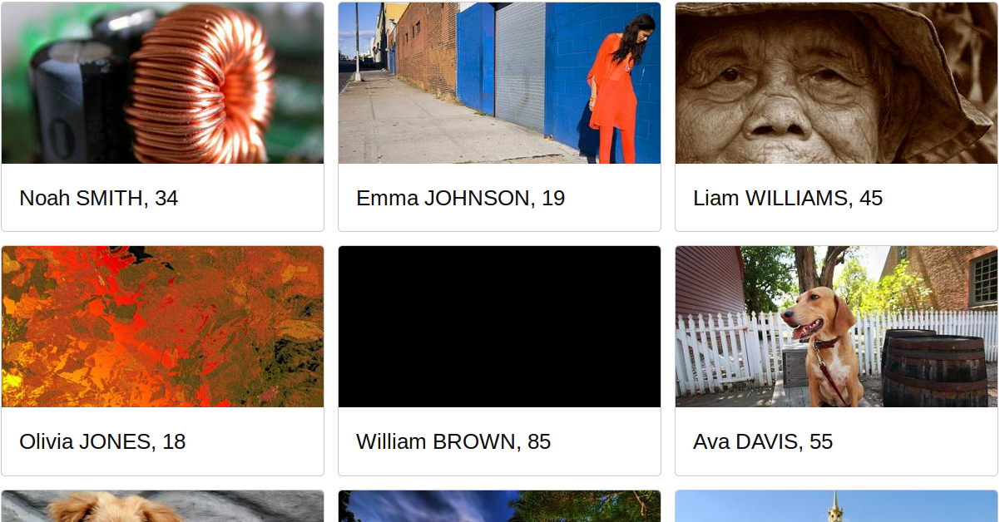
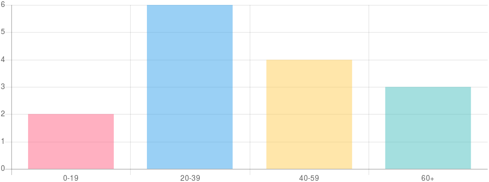
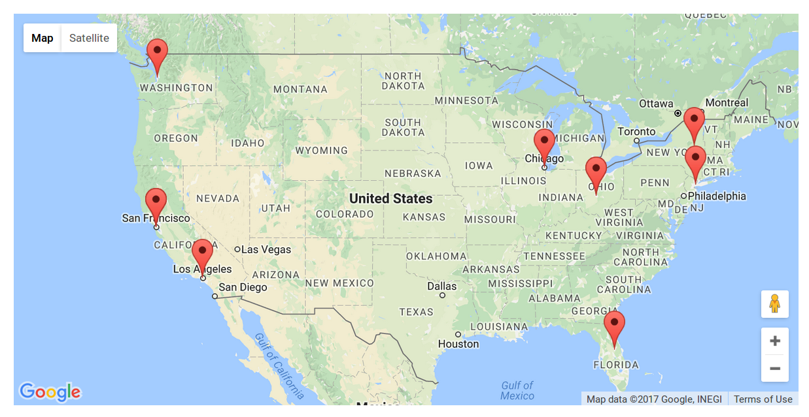

# Spreadsheet

In this tutorial you'll learn how to take a Google Spreadsheet and convert it into a read-only database for Node.js. We will see some possible front-end applications such as data analysis and geolocation in a map.

This is useful for simple and small datasets that might be modified by non-technical people since everyone knows how to edit spreadsheets. The data will then be available on the site as it is modified by several people simultaneously on Google Drive.

Some possible uses:

- Publish a graph with monthly revenue or users info that you are already using internally.
- Startup employee list is in a Spreadsheet for internal use and visible on the website.
- Keep track of your trips similar to [how Martin does it](https://wherethefuckismartin.com/) (note: not related to server.js).


## Create a spreadsheet

First we'll have to go to [Google Spreadsheets](https://docs.google.com/spreadsheets/) and create a new Blank spreadsheet:



The spreadsheet has to have a specific structure, where the first row has the names of the columns and the rest has the content:



Now we have to publish the spreadsheet so that we can read it from our back-end. Press `File` > `Publish to the web` > `Publish`:



Finally make a note of the current spreadsheet URL. It will be something like this: https://docs.google.com/spreadsheets/d/1FeG6UsUC_BKlJBiy3j_c4uctMcQlnmv9iyfkDjuWXpg/edit


## Installation

After [getting your project started](https://en.libre.university/lesson/V1f6Btf8g/Getting started), we'll be using the packages `server` and [`drive-db`](https://www.npmjs.com/package/drive-db):

```bash
npm install server drive-db
```


## Back-end with server.js

Let's get to program. Create our file `index.js`:

```js
// Load the dependencies
const server = require('server');
const { render } = server.reply;

// The URL fragment between "spreadsheets/d/" and "/edit"
const id = '1FeG6UsUC_BKlJBiy3j_c4uctMcQlnmv9iyfkDjuWXpg';
const drive = require('drive-db')(id);

// Launch the server in port 3000
server(async () => {

  // Local or remote (depends on the cache expiration)
  const db = await drive.load();

  // Render the index with the user data
  return render('index.hbs', { users: db.find() });
});
```

That is it, everything you will need for the back-end. Load the libraries, set up a route and launch the server.


## Front-end

Now let's do some fun stuff with the front-end. Create the file `views/index.hbs` with this:

```html
<!DOCTYPE html>
<html>
<head>
  <link rel="stylesheet" href="https://unpkg.com/picnic@6">
  <style>
    main { width: 90%; max-width: 800px; margin: 30px auto; }
    table, canvas, img { width: 100%; }
    h2 { padding-bottom: 20px; }
    .card { margin: 0; }
    #map { height: 400px; }
  </style>
</head>
<body>
  <main>
    <h1>Users</h1>

    ...

  </main>
</body>
```

We added [Picnic CSS](https://picnicss.com/) to make it easier to develop, however you can use any front-end CSS library that you prefer. We will see several ways of representing our data.


### Simple list

The easy way, just create a list with the first name and last name:

```html
<main>
  <h1>Users</h1>
  <ul>
    {{#each users}}
      <li>{{this.firstname}} {{this.lastname}}</li>
    {{/each}}
  </ul>
</main>
```

This will render an HTML list like this:


### Table

Let's show them in a table as they appear in the Spreadsheets:

```html
<table>
  <tr>
    <th>Firstname</th> <th>Lastname</th> <th>Age</th> <th>City</th>
  </tr>
  {{#each users}}
    <tr>
      <td>{{this.firstname}}</td>
      <td>{{this.lastname}}</td>
      <td>{{this.age}}</td>
      <td>{{this.city}}</td>
    </tr>
  {{/each}}
</table>
```




### Cards




### Demographics by age




### Demographics by location


