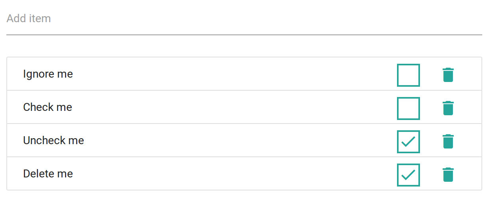

# TO-DO list

<a class="button" href="https://github.com/franciscop/server-tutorial-todo">Source code</a>

In this tutorial you will learn to design a basic API to create a list of items. We store them in a MongoDB database using Mongoose and it will be for a single person.

Some possible uses:

- An actual TO-DO list. Some times you just need a simple list.
- The beginning of Hacker News, Reddit, or similar. Those are basically four glorified CRUDs: users, stories, comments, votes.

End product:




## Install dependencies

After [getting your project ready](/tutorials/getting-started) you'll have to make sure that you have MongoDB installed following [the official guide](https://docs.mongodb.com/manual/administration/install-community/) and run it (will depend on your installation process). To check that you have it on Ubuntu do:

```bash
mongod --version   # Should display a number
mongod
```

Then we install the two libraries that we will be using **within our project folder**:

```bash
npm install server mongoose
```


## REST API

Let's first of all define our API. Let's keep it simple! Within index.js we write:

```js
const server = require('server');
const { get, post, put, del } = server.router;
const { render, status, json } = server.reply;

// Render the homepage for `/`
const home = get('/', ctx => render('index.hbs'));

// Add some API endpoints
const api = [
  get('/todo', /*TODO*/),
  post('/todo', /*TODO*/),
  put('/todo/:id', /*TODO*/),
  del('/todo/:id', /*TODO*/)
];

// Launch the server with those
server(home, api);
```


## Database

We are using Mongosse (a layer on top of MongoDB) to implement


## Functionality

Now let's implement each of the parts. We will do it first in the same file, then (as it might happen in real life) we will split that code into a separate file to keep things clean and concerns separated.

First the get; we won't be doing a strict REST API since the GET will be rendering the HTML, but quite similar:

```js
get('/', ctx => {

})
```


## Testing

<blockquote class="error">This section describes a future API and it is not available yet</blockquote>

We will be using [Jest](https://facebook.github.io/jest/) and [Supertest](https://github.com/visionmedia/supertest) for testing, but you can use any library or framework that you prefer. First install those:

```
npm install jest supertest --save-dev
```

For testing we have to make a small change in our main `index.js`: we export the return value from server():

```js
// ...

module.exports = server(home, api);
```

Then we can import it from the integration tests. Let's create a `test.js`:

```js
// test.js
const instance = require('./index.js');

describe('Homepage', () => {
  it('renders the homepage', async () => {
    const ctx = await instance;
    return request(app)
      .get('/')
      .expect(200)
      .then(response => {
        expect(response.body).toMatch(/\<h1\>TODO list<\/h1>/i);
      });
  });
});
```
